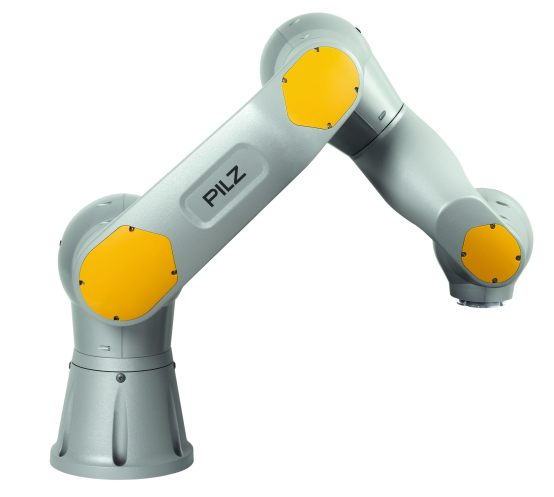
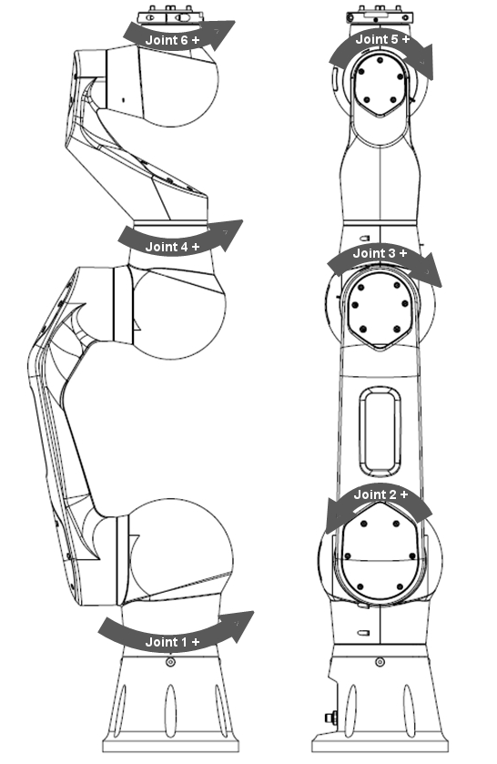

# ROS_PRBT

## Package: pilz_robots
The meta package for the robot packages.



## Package: prbt_support
The package contains the robot description of the PRBT manipulator.
- `urdf/` contains the xacros for generating the urdf descriptions of the PilzLWA.
  - `generate_and_test_ik.sh` is a script to generate `ikfast.cpp` from urdf model.
- `meshes/` contains the stl files for visualization
- `test/` contains the test files for urdf
  - build tests: `catkin_make tests`
  - build and run tests: `catkin_make run_tests`

## Package: prbt\_moveit\_config
The package is generated by moveit setup assistant. It contains configuration files needed to start up the robot including planning and execution.

### Configuring the robot
Use the launch file moveit_planning_execution to bringup the robot controllers
with the complete moveit pipeline.
The launch file allows to set optional parameters
* `sim` (default: True) <br>
	Use fake execution and display emulated robot position in RViz
* `pipeline` (default: ompl) <br>
    Planning pipeline to use with MoveIt
* `has_gripper` (default: False) <br>
    PG+70 gripper attached to the robot flange

#### Configure the tcp
1. Open prbt_support/urdf/prbt.xacro
2. Edit the lines to your desired offset

```
  <xacro:unless value="$(arg has_gripper)">
    <xacro:arg name="tcp_offset_xyz" default="0 0 0"/>
    <xacro:arg name="tcp_offset_rpy" default="0 0 0"/>
  </xacro:unless>

  <xacro:if value="$(arg has_gripper)">
    <xacro:arg name="tcp_offset_xyz" default="0 0 0.1"/>
    <xacro:arg name="tcp_offset_rpy" default="0 0 0"/>
  </xacro:if>
```

Note: You can set different default offsets dependend if you have attached a gripper or not.

### Running the simulation
1. Run `roslaunch prbt_moveit_config moveit_planning_execution.launch sim:=true pipeline:=ompl has_gripper:=true`
2. Use the Moveit Motion Plugin to plan and execute

### Running on the real robot
1. Bringup can: `sudo ip link set can0 up type can bitrate 1000000`
2. Run `roslaunch prbt_moveit_config moveit_planning_execution.launch sim:=false pipeline:=ompl has_gripper:=true`
3. Use the Moveit Motion Plugin to plan and execute

## Package: prbt_ikfast_manipulator_plugin
The package is moveit plugin for inverse kinematics, which is a wrapper of `ikfast.cpp` to the kinematics base interface of moveit.

## Pilz Coordinate Frames
To see the robot in rviz you can use
``roslaunch prbt_support test_urdf.launch``



## Dependencies
| Dependency |                         Code                         |       License        |
| ---------- | ---------------------------------------------------- | --------------------- |
| openrave   | https://github.com/rdiankov/openrave                 | LGPL 3.0 / Apache 2.0 |
